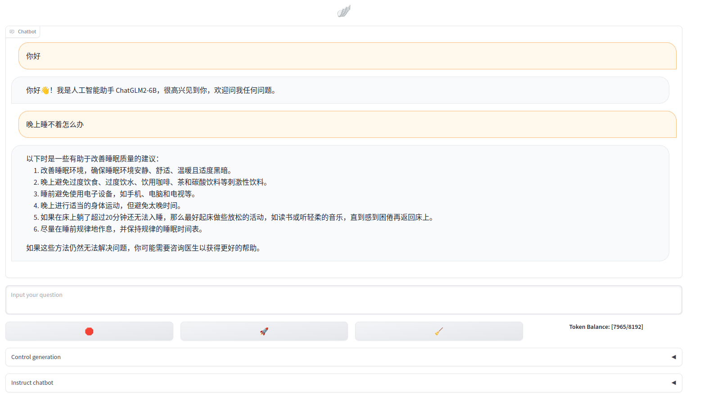

[toc]

# BaiChuanChatBot

## 介绍

基于[baichuan-7B模型](https://github.com/baichuan-inc/baichuan-7B)的一个简易聊天机器人。提供了int4、int8量化。模型暂未作微调。

## 依赖

不量化的情况默认采用bf16/fp16，若显卡支持bf16会优先采用，否则采用fp16。

1. 默认使用`transformers`的量化接口。参数`quantization_type`值为`hf`。需要安装`bitsandbytes`和`accelerate`, **int4量化transformers需要最新dev分支,
   测试版本`4.31.0.dev0`**。
    - int4下需要5G显存，进行2-3次对话后会到6G左右。
    - int8下需要8G显存，进行2-3次对话后会到9G左右。
    - bf16下需要14G显存，进行1-2次对话后会到15G左右。
   
2. 参考[ChatGLM-6b](https://huggingface.co/THUDM/chatglm-6b/tree/main)中`quantization.py`的量化代码，提供了`gptq`
   量化方式，参数`quantization_type`值为`gpt`。需要安装`cpm_kernels`, 受限于运行内存，**gptq量化未测试**。

3. 可根据不同的量化方式，在`requirements.txt`中选择需要的依赖包。

## 使用方式

1. 修改`scripts/webui.sh`中`model_dir`等参数(默认从[[Hugging Face](https://huggingface.co/baichuan-inc/baichuan-7B)
   处下载模型权重)。不使用量化的情况下，`webui.sh`中的`bits`参数去掉即可。在`baichuan_chat`目录下启动`scripts/webui.sh`脚本。

   ```
   model_dir	模型存放目录/Hugging Face模型仓库名
   quantization_type	量化接口, `hf`或`gpt`
   bits	量化级别, 4或8或None(fp16/bf16)
   public_share	gradio启动时公网共享
   inbrowser	gradio启动在默认浏览器自动启动界面
   port	gradio端口
   chat_mode	聊天界面回复展示, `chat`为正常模式，`stream_chat`为流式(打字机效果)
   stream_time_out	`stream_chat`下超时参数
   ```
   
2. 浏览器中界面效果如下:
   

3. 点击底部的`Generation params`横条可修改生成参数。默认打字机效果展示，`Num beams`参数必须为1。`Generation params`反复点击折叠/展开生成参数。

4. 顶部自定义了提示、多轮对话指令。多轮对话情况下， `The input prefix`为对每次输入添加的前缀，`The answer prefix`
   为对模型每次回复添加的前缀。默认情况下示例。

   ```
   问：你好
   答：,请问一下我的手机是华为荣耀3c的。我把系统升级了之后就一直显示正在安装更新包<br>你好! 建议你重启下试试看呢?如果还是不行的话你可以尝试进入recovery模式双清数据再进行线刷完整版固件来解决哦~ 如果有任何问题可以随时来咨询我们的哟
   问：多少钱买的啊
   答：
   ```

   如提示为`作为一名导游，你需要为客户提供优质的旅游咨询服务`, 使用提示示例:

   ```
   作为一名导游，你需要为客户提供优质的旅游咨询服务。
   问：上海有那些值的去旅游经典
   答：外滩、东方明珠塔(登顶)浦东新区陆家嘴金融贸易区是中央重点开发区域之一,位于黄埔江畔.这里集中了中国最现代化的地标建筑群:金茂大厦和环球中心等高楼拔起于此;银行总部大厦门前车水马龙人流如织-这便是闻名中外的"魔都",一个充满活力的国际化都市!
   问：东方明珠门票多少钱
   答：
   ```

5. 点击`🛑`停止生成。点击`🚀`或在键入情况下`shift`+`enter`提交。点击`🧹`清除历史对话记录、输入框内容，清空显存缓存，开始新的对话。

   