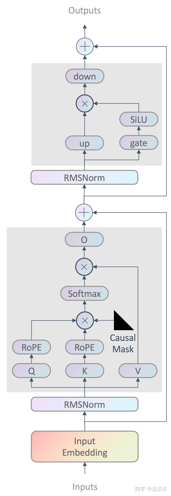

对`modeling_chatglm.py`的一些精简优化:

1. 在注入位置信息(旋转位置编码)的过程中, 将`RotaryEmbedding` `forward`中每次计算cos, sin项提取为类属性通过`register_buffer`注册进内存中, 复用cos,sin后不用在每次模型forward过程中计算cos, sin.

2. Attention mask 的实现在训练时貌似不预期. 假设训练时不使用`PTuning`. `pre_seq_len`为None/0, 

   样本

   ```python
       text = [
           '你好啊',
           '今天天气不错呢！'
       ]
       encode = tokenizer(text, return_tensors='pt', padding=True, add_special_tokens=False)
       print(encode['attention_mask'])
       
       """
   tensor([[0, 0, 1, 1, 1],
           [1, 1, 1, 1, 1]])    
       """
   ```

   `ChatGLMModel.forward`中处理`attention_mask`逻辑.  第一个if 不执行,第二个if 执行进入`get_masks`

   ```python
           if self.pre_seq_len is not None:
               if past_key_values is None:
                   past_key_values = self.get_prompt(batch_size=batch_size, device=input_ids.device,
                                                     dtype=inputs_embeds.dtype)
               if attention_mask is not None:
                   attention_mask = torch.cat([attention_mask.new_ones((batch_size, self.pre_seq_len)),
                                               attention_mask], dim=-1)
   
           if full_attention_mask is None:
               if (attention_mask is not None and not attention_mask.all()) or (past_key_values and seq_length != 1):
                   full_attention_mask = self.get_masks(input_ids, past_key_values, padding_mask=attention_mask)
                   
   ```

   调用`get_masks`后的结果

   ```python
       text = [
           '你好啊',
           '今天天气不错呢！'
       ]
       encode = tokenizer(text, return_tensors='pt', padding=True, add_special_tokens=False)
       print(encode)
       print('=' * 128)
       res = get_masks(encode['input_ids'], past_key_values=None, padding_mask=encode['attention_mask'])
       print(res)
       
   """    
   {'input_ids': tensor([[    0,     0, 36474, 54591, 55674],
           [53456, 33071, 32884, 55282, 31404]]), 'attention_mask': tensor([[0, 0, 1, 1, 1],
           [1, 1, 1, 1, 1]]), 'position_ids': tensor([[0, 0, 0, 1, 2],
           [0, 1, 2, 3, 4]])}
   ================================================================================================================================        
   tensor([[[[False, False, False, False, False],
             [False, False, False, False, False],
             [ True,  True, False,  True,  True],
             [ True,  True, False, False,  True],
             [ True,  True, False, False, False]]],
   
   
           [[[False,  True,  True,  True,  True],
             [False, False,  True,  True,  True],
             [False, False, False,  True,  True],
             [False, False, False, False,  True],
             [False, False, False, False, False]]]])
   """
   ```

   MHA的逻辑`CoreAttention.forward`, 下面执行else语句再反转attn

   ```python
       def forward(self, query_layer, key_layer, value_layer, attention_mask):
           pytorch_major_version = int(torch.__version__.split('.')[0])
           if pytorch_major_version >= 2:
               query_layer, key_layer, value_layer = [k.permute(1, 2, 0, 3) for k in [query_layer, key_layer, value_layer]]
               if attention_mask is None and query_layer.shape[2] == key_layer.shape[2]:
                   context_layer = torch.nn.functional.scaled_dot_product_attention(query_layer, key_layer, value_layer,
                                                                                    is_causal=True)
               else:
                   if attention_mask is not None:
                       attention_mask = ~attention_mask
                   context_layer = torch.nn.functional.scaled_dot_product_attention(query_layer, key_layer, value_layer,
                                                                                    attention_mask)
               context_layer = context_layer.permute(2, 0, 1, 3)
               new_context_layer_shape = context_layer.size()[:-2] + (self.hidden_size_per_partition,)
               context_layer = context_layer.reshape(*new_context_layer_shape)
   
    # 进入 torch.nn.functional.scaled_dot_product_attention的attn张这样
   """
   tensor([[[[ True,  True,  True,  True,  True],
             [ True,  True,  True,  True,  True],
             [False, False,  True, False, False],
             [False, False,  True,  True, False],
             [False, False,  True,  True,  True]]],
   
   
           [[[ True, False, False, False, False],
             [ True,  True, False, False, False],
             [ True,  True,  True, False, False],
             [ True,  True,  True,  True, False],
             [ True,  True,  True,  True,  True]]]])
   """
   ```

   可以看到第一个mask矩阵不符合预期. 预期应该张这样子.

   ```python
   """
   
   tensor([[[[False, False, False, False, False],
             [False, False, False, False, False],
             [False, False,  True, False, False],
             [False, False,  True,  True, False],
             [False, False,  True,  True,  True]]],
   
   
           [[[ True, False, False, False, False],
             [ True,  True, False, False, False],
             [ True,  True,  True, False, False],
             [ True,  True,  True,  True, False],
             [ True,  True,  True,  True,  True]]]])
   """
   ```

   重新实现了一下, `ChatGLMModel.forward`

   ```python
           # 3.  Invert attention_mask, add padding mask and expand it: [batch_size, 1, seq_len, src_len]
           if self.pre_seq_len and past_key_values is not None:
               # In the inference, use cache, use `p-tuning v2`, the `past_key_values` contain `prefix-prompt-embedding`
               past_len = past_key_values[0][0].shape[0] - self.pre_seq_len
           elif past_key_values is not None:
               # In the inference, use cache, not use `p-tuning v2`
               past_len = past_key_values[0][0].shape[0]
           else:
               # training or Inference(not use cache, or first forward)
               past_len = 0
           full_attention_mask: torch.BoolTensor = self.prepare_masks(
               input_shape=(inputs_embeds.size(1), inputs_embeds.size(0)),  # [batch_size, seq_len]
               device=inputs_embeds.device,
               past_len=past_len,
               padding_mask=attention_mask,
               prefix_encoder_prompt_len=self.pre_seq_len if self.pre_seq_len else 0,
           )
   ```

   ```python
       @staticmethod
       def prepare_masks(
               input_shape: Union[torch.Size, Tuple],
               device: Union[torch.device, str],
               past_len: int = 0,
               padding_mask: Optional[torch.Tensor] = None,
               prefix_encoder_prompt_len: int = 0,
       ) -> torch.BoolTensor:
           """Prepare `attn_mask` for <torch.nn.functional.scaled_dot_product_attention>
   
                   # Efficient implementation equivalent to the following:
                   attn_mask = torch.ones(L, S, dtype=torch.bool).tril(diagonal=0) if is_causal else attn_mask
                   attn_mask = attn_mask.masked_fill(not attn_mask, -float('inf')) if attn_mask.dtype==torch.bool else attn_mask
                   attn_weight = torch.softmax((Q @ K.transpose(-2, -1) / math.sqrt(Q.size(-1))) + attn_mask, dim=-1)
                   attn_weight = torch.dropout(attn_weight, dropout_p)
                   return attn_weight @ V
   
           Args:
               input_shape:
               device:
               past_len:
               padding_mask: The strategy of padding must be 'left'
               prefix_encoder_prompt_len:
   
           Examples:
   
               For train:
                       input:
                           input_shape: (2, 5)
                           past_len: 0
                           padding_mask:
                               [
                                   [0, 0, 1, 1, 1],
                                   [1, 1, 1, 1, 1]
                               ]
   
                       Output:
                           [[[[False, False, False, False, False],
                             [False, False, False, False, False],
                             [False, False,  True, False, False],
                             [False, False,  True,  True, False],
                             [False, False,  True,  True,  True]]],
   
   
                           [[[ True, False, False, False, False],
                             [ True,  True, False, False, False],
                             [ True,  True,  True, False, False],
                             [ True,  True,  True,  True, False],
                             [ True,  True,  True,  True,  True]]]]
   
               For batch inference:
                       input:
                           input_shape: (2, 5)
                           past_len: 2
                           padding_mask:
                               # past_padding_mask   new_padding_mask
                               [[1, 1,               0, 0, 1, 1, 1],
                               [0, 1,                1, 1, 1, 1, 1]]
   
                       Output:
                           [[[[ True,  True, False, False, False, False, False],
                             [ True,  True, False, False, False, False, False],
                             [ True,  True, False, False,  True, False, False],
                             [ True,  True, False, False,  True,  True, False],
                             [ True,  True, False, False,  True,  True,  True]]],
   
                           [[[False,  True,  True, False, False, False, False],
                             [False,  True,  True,  True, False, False, False],
                             [False,  True,  True,  True,  True, False, False],
                             [False,  True,  True,  True,  True,  True, False],
                             [False,  True,  True,  True,  True,  True,  True]]]]
           Returns:
   
           """
           batch_size, tgt_len = input_shape
           total_len = prefix_encoder_prompt_len + past_len + tgt_len
   
           # The input_ids's causal mask
           causal_mask = torch.ones(batch_size, tgt_len, tgt_len, device=device).tril_()
           if past_len + prefix_encoder_prompt_len:
               causal_mask = torch.cat(
                   [
                       torch.ones(batch_size, tgt_len, past_len + prefix_encoder_prompt_len, device=device),
                       causal_mask
                   ],
                   dim=-1
               )
   
           # past padding mask + current padding mask    or    current padding mask
           if padding_mask is not None:
               if padding_mask.size(0) != batch_size:
                   raise ValueError('Attention mask should have the same size as the batch size.')
   
               if prefix_encoder_prompt_len:
                   padding_mask = torch.cat(
                       [
                           torch.ones(batch_size, tgt_len, prefix_encoder_prompt_len, device=device),
                           padding_mask
                       ],
                       dim=-1
                   )
   
               if padding_mask.size(1) != total_len:
                   raise ValueError(
                       f"Attention mask should be of size {(batch_size, total_len)}, "
                       f"but is {padding_mask.size()}"
                   )
   
               causal_mask = causal_mask * padding_mask.unsqueeze(1)
   
           # [batch_size, seq_len, src_len] => [batch_size, 1, seq_len, src_len]
           return (causal_mask > 0.5).bool()[:, None, ...]
   ```

   `CoreAttention.forward`

   ```python
       def forward(self, query_layer, key_layer, value_layer, attention_mask: torch.BoolTensor) -> torch.Tensor:
           """
   
           Args:
               query_layer: [tgt_len, batch_size, num_heads, head_head_size]
               key_layer: [src_len, batch_size, num_heads, head_head_size]
               value_layer: [src_len, batch_size, num_heads, head_head_size]
               attention_mask: [batch_size, 1, seq_len, src_len]
   
           Returns: [tgt_len, batch_size, hidden_size]
   
           """
           # [seq_len, batch_size, num_heads, head_hidden_size] => [batch_size, num_heads, seq_len, head_hidden_size]
           query_layer, key_layer, value_layer = [k.permute(1, 2, 0, 3) for k in [query_layer, key_layer, value_layer]]
   
           # [batch_size, num_heads, tgt_len, head_hidden_size]
           context_layer = torch.nn.functional.scaled_dot_product_attention(
               query_layer,
               key_layer,
               value_layer,
               attention_mask
           )
   ```

3. torch版本强制2.0及以上, 使用[torch.nn.functional.scaled_dot_product_attention`](https://pytorch.org/docs/stable/generated/torch.nn.functional.scaled_dot_product_attention.html)加速attention计算

4. 根据`config.json`和`configuration_chatglm.py`去掉在前向传播中的if else 判断, 精简代码. 如dropout为0, MQA, rmsnorm, PTuning2微调的的Encoder等.

5. `stream_generate`中的生成参数提取到`stream_chat`, 在打字机模式使用cache时候复用这部分参数.

6. 其他一些小细节优化.

7. 代码多了些许注释.

8. web服务流程优化, 减少正则化等，界面丰富了一下.

   
整体来看，在decoder-only的视角下，chatglm2-6b的结构和llama除了attention不一样外，其他均一样。
chatglm2-6b用的是Multi-Query Attention，其中k,v是2组, 在进行attention 计算时将k,v的2组扩展到所有头共享，2 -> 32，即16个头的参数是一样的。
llama-7b用的是标准的Mutil-Head Attention, k,v,q的32个头参数是不共享的。

[原图出处](https://zhuanlan.zhihu.com/p/636784644)


